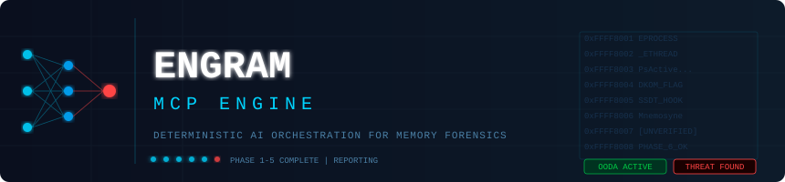

# Engram MCP: Deterministic AI Orchestration for Memory Forensics



[](https://opensource.org/licenses/MIT)

**A Model Context Protocol (MCP) Approach to Autonomous Digital Forensics and Incident Response (DFIR)**

## 1. Problem Statement & Baseline Empirical Observations
The integration of Large Language Models (LLMs) into autonomous DFIR workflows has historically relied on piping agent outputs directly into interactive Unix/Linux bash shells (e.g., SANS SIFT). To establish a baseline, we subjected an unconstrained LLM agent to a standard memory forensics CTF (MemLabs Lab 5: "Black Tuesday") via raw terminal I/O. 

While the agent successfully completed initial triage—identifying a rogue `NOTEPAD.EXE`, decoding base64 arguments, and correlating network sockets—the architecture suffered a cascading failure at the 20-minute mark, consuming over 147,000 tokens before manual abortion. This baseline assessment revealed three critical, inherent flaws in the "LLM-to-Terminal" paradigm:

1. **Context Asphyxiation via Unstructured Data:** Forensics tools output high-volume, unstructured tabular data. When attempting to locate a password for an extracted archive, the agent dumped 176+ lines of raw hexadecimal and virtual allocations directly into `stdout`. Forcing an LLM to parse raw graphical hex dumps exhausted its active context window, causing severe degradation in reasoning.
2. **Asynchronous I/O Blocking (The Interactive Hang):** Standard CLI tools frequently block execution threads to await `STDIN` (e.g., password prompts). Lacking an asynchronous mechanism to intercept `STDERR/STDOUT` prompts and inject `STDIN`, the agent entered a token-burning loop.
3. **Syntax Hallucination Under State Collapse:** As context decayed due to data flooding, the agent's ability to maintain rigid command-line syntax deteriorated, resulting in repeated tool failures.

**Conclusion:** The raw terminal is an inherently flawed interface for AI agents. To achieve reliable autonomy, the reasoning engine must be strictly decoupled from the execution layer.

---

## 2. Architectural Methodology
To resolve the baseline failures, we engineered **Engram MCP**, utilizing the Model Context Protocol (MCP) to replace brittle terminal sessions with deterministic, JSON-structured APIs.

### Component Breakdown & Addressed Flaws
* **The Evidence Layer:** Raw memory dumps (`.img`, `.raw`, `.vmem`).
* **Telemetry Extraction (Volatility 3 Framework):** Serves as the base forensic engine, relying on symbol tables and plugins for memory carving.
* **Control & Safety Layer (Python FastMCP Server):** This is the core architectural innovation. It abstracts complex CLI syntax into deterministic Python functions (e.g., `tool_phase1_surface_triage`).
  * *Addressed Flaw:* Eliminates Syntax Hallucination. The LLM only passes parameters (like PIDs); the Python server enforces the exact Volatility execution string.
  * *Addressed Flaw:* Resolves I/O Blocking. Python `subprocess` wrappers handle timeouts and intercept hanging executions, gracefully returning an error state.
* **Orchestration Layer (LLM Agent & `CLAUDE.md`):** The LLM operates strictly within a 6-Phase OODA loop governed by the system prompt, consuming lightweight JSON summaries.
  * *Addressed Flaw:* Prevents Context Asphyxiation by filtering heavy tabular data before it hits the LLM context window.

---

## 3. Key Features & Technical Innovations

### 3.1 Mitigating LLM Training Contamination (Zero-Knowledge Analysis)
If an LLM recognizes the filename of a publicly documented forensic image (e.g., SANS 2018 APT datasets), it will often "Semantically Anchor"—hallucinating findings based on pre-trained internet write-ups rather than live telemetry. Engram MCP enforces **Zero-Knowledge Analysis** by stripping target metadata. This guarantees findings are derived purely from extracted memory structures.

### 3.2 Autonomous Direct Kernel Object Manipulation (DKOM) Correlation
During empirical testing against a Ring-0 rootkit (`Mnemosyne.sys`), the underlying OS API layer (`pslist`) returned 0 active processes. Rather than halting, the agent cross-referenced this with physical memory carving (`psscan`), which returned 131 processes. The agent successfully correlated this discrepancy to mathematically prove the `PsActiveProcessHead` had been unlinked by a DKOM attack.

### 3.3 Strict State Enforcement via OODA Loop
To prevent the agent from executing plugins out of order, the engine enforces a rigid Markdown State Tracker (`[x]`). The agent must explicitly acknowledge the completion of:
1. Surface Triage
2. Deep User-Space Analysis
3. Kernel Abyss (Ring 0) Analysis
4. Advanced Evasion
5. Dynamic Substantiation 
6. Incident Reporting

---

## 4. Constraint Implementation: Honesty Over Perfection
The most critical capability of an AI agent is knowing when its telemetry is compromised. During legacy OS testing (Windows XP), modern Volatility plugins crashed. Initially, the LLM falsely interpreted this empty return array as a "Clean" state.

To enforce absolute integrity, we implemented the **Empty Data Protocol**:
* **Architectural Boundary:** If a tool fails, the Python MCP server deterministically injects a strict string: `"UNVERIFIED: Tool returned no data."`
* **Prompt Boundary:** The Universal Anti-Hallucination Guardrail in the system prompt explicitly forbids the use of definitive terms (e.g., "clean") if the "UNVERIFIED" tag is present. 

As a result, if a Ring-0 rootkit blinds the extraction tools, the agent dynamically generates a **"Forensic Blind Spots"** matrix, explicitly detailing to human SOC analysts which subsystems are unverified.

---

## 5. Installation & Setup Instructions

### Prerequisites
* Python 3.10+
* `git`
* [Volatility 3 Framework](https://github.com/volatilityfoundation/volatility3) (with Windows symbol tables downloaded)
* An MCP-compatible AI client (e.g., [Claude Code](https://github.com/anthropics/claude-code))

### Deployment Steps
1. **Clone the Repository**
   ```bash
   git clone https://github.com/Kirtar22/engram-mcp.git
   cd engram-mcp
   ```

2. **Set Up the Virtual Environment**
   ```bash
   python -m venv venv
   source venv/bin/activate  # On Windows: venv\Scripts\activate
   pip install -r requirements.txt
   ```

3. **Configure Volatility 3 Path**
   Ensure Volatility 3 is downloaded and its dependencies are installed:
   ```bash
   git clone https://github.com/volatilityfoundation/volatility3.git
   cd volatility3
   pip install .
   ```
   The Engram MCP server dynamically looks for Volatility. You must set the VOLATILITY_PATH environment variable before starting Claude Code:

   ```bash
   export VOLATILITY_PATH=/path/to/your/volatility3/vol.py
   ```
4. **Register the MCP Server**
   Link the Python server to your AI orchestrator:
   ```bash
   claude mcp add engram python mcp_server.py
   ```

---

## 6. Usage: Running an Investigation

1. Place your target memory dump in the `/cases/` directory.
2. Launch your agent from the terminal:
   ```bash
   claude
   ```
3. Issue the master prompt:
   ```text
   Investigate the <filename>.img dump based on your CLAUDE.md instructions. Do not pause to ask for my permission between phases; execute the entire OODA loop autonomously. Follow your state-tracking checklist.
   ```
The agent will execute the 6 phases autonomously and save a markdown Incident Report to the disk.

---

## 7. Hackathon Artifacts Reference
Judges can find the required SANS hackathon documentation in the `submission_package/` directory:
* `PROJECT_DESCRIPTION.md`: In-depth empirical research and architectural methodology.
* `ACCURACY_REPORT.md`: Honest self-assessment detailing false positives, tool limitations, and successful self-corrections.
* `DATASET_DOCUMENTATION.md`: Overview of the memory profiles tested (WinXP, Win7, Win10).
* `Architecture_Diagram.png`: Visual layout of the decoupled MCP architecture.
* `conversation_logs/`: Raw execution traces demonstrating the agent's autonomous reasoning.

---

## License

MIT License

Copyright (c) 2026 Engram MCP Team

Permission is hereby granted, free of charge, to any person obtaining a copy
of this software and associated documentation files (the "Software"), to deal
in the Software without restriction, including without limitation the rights
to use, copy, modify, merge, publish, distribute, sublicense, and/or sell
copies of the Software, and to permit persons to whom the Software is
furnished to do so, subject to the following conditions:

The above copyright notice and this permission notice shall be included in all
copies or substantial portions of the Software.

THE SOFTWARE IS PROVIDED "AS IS", WITHOUT WARRANTY OF ANY KIND, EXPRESS OR
IMPLIED, INCLUDING BUT NOT LIMITED TO THE WARRANTIES OF MERCHANTABILITY,
FITNESS FOR A PARTICULAR PURPOSE AND NONINFRINGEMENT. IN NO EVENT SHALL THE AUTHORS OR COPYRIGHT HOLDERS BE LIABLE FOR ANY CLAIM, DAMAGES OR OTHER LIABILITY, WHETHER IN AN ACTION OF CONTRACT, TORT OR OTHERWISE, ARISING FROM, OUT OF OR IN CONNECTION WITH THE SOFTWARE OR THE USE OR OTHER DEALINGS IN THE SOFTWARE.