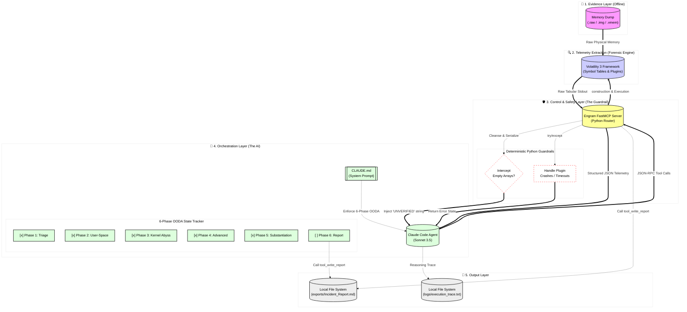

# 🗺️ Engram MCP: AI DFIR Architecture Diagram

This diagram visualizes the deterministic data pipeline of Engram MCP. It illustrates how the architecture decouples the LLM Orchestrator from raw tool execution, enforcing the 5-Phase OODA Loop methodology via Model Context Protocol (MCP) JSON telemetry.

